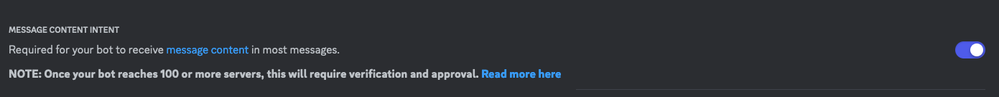

# Amelia-React

Comment contribuer ? simple: 
1. choisit ou creer un dossier
2. Mets ton fichier js à l'intérieur
3. fait une pr

À la prochaine mise à jour d'amelia -> pop ton module est en production

Un exemple ? `./__template/main.js`

# Tests: 
Création d'un fichier `token.txt` avec le token de votre bot de test.

ne pas oublier d'activer:
